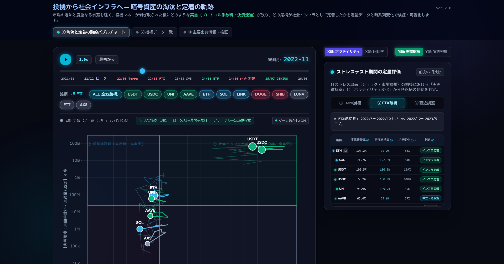

# 暗号資産の淘汰と社会インフラ定着の軌跡（2021–2026）
> **Crypto Utility Trajectory & Stress-Test Analytics Dashboard (2021–2026)**

2021年1月から2026年8月までの約5年半（月次確定データ812レコード）にわたり、暗号資産主要12銘柄のオンチェーン手数料収益・決済流通量（実需）と市場動態（ボラティリティ・時価総額）を追跡し、**「投機から社会インフラへの定着プロセス」および「市場ショックによる淘汰」を可視化したインタラクティブ・アナリティクスSPAダッシュボード**です。

---

## 🌐 インタラクティブ・ダッシュボード（Live Demo）

ブラウザ上でインストール不要・完全スタンドアロンで即座に動作します：
👉 **[Live Dashboard を開く（GitHub Pages）](https://naohisastry.github.io/crypto-utility-trajectory/)**

---

## 📌 プロジェクトの概要と問題意識

「暗号資産は単なる価格思惑の投機対象なのか、それとも社会的な決済・金融インフラへと移行し得るのか？」

従来の市場観測では、価格（トークン価格）の上下動に過度に焦点が当てられ、プロトコルが提供する実際の経済価値が見落とされがちでした。本分析では、**「プロトコルが稼得する月間手数料収益（Fees）」** や **「決済・担保に利用される流通供給量（Supply）」** を **「実需（Utility）」** と定義。

ボラティリティ（リスク）や出来高回転率を横軸に、実需規模や実需密度を縦軸に配置した **4象限フレームワーク** と、過去の3大市場ショック（Terra崩壊・FTX破綻・直近市場調整）を検証する **ストレステスト定量評価** を通じて、暗号資産の真の持続可能性とインフラ性を客観的に解明します。

---

## 🧭 4象限ポジショニング・フレームワーク

客観的データ駆動基準である **「市場中央値（Median）」** を動的境界として採用し、各時点の暗号資産を4つの明確なカテゴリーに分類・追跡します。

| 象限区分 | 定義と市場特性 | 該当する代表銘柄 | 軌跡・バブル表現 |
| :--- | :--- | :--- | :--- |
| **① 社会インフラ定着** | **低ボラティリティ × 高実需** 決済・金融流動性の基盤として日常利用が定着し、価格変動に依存しない実需基盤を確立した領域。 | USDT, USDC, UNI, AAVE | エメラルド緑バブル・実線軌跡 |
| **② 成長過渡期・活況** | **高ボラティリティ × 高実需** 高いエコシステム収益・実利用を伴いながらも、技術革新や拡張（L2統合等）の途上にあり成長痛を伴う領域。 | ETH, SOL, LINK | スカイ青バブル・実線軌跡 |
| **③ 投機過熱** | **高ボラティリティ × 低実需** 実質的なプロトコル収益やキャッシュフローがほぼ存在せず、コミュニティの期待や価格思惑のみで取引される領域。 | DOGE, SHIB | ローズ赤バブル（実需床値） |
| **④ 淘汰・消滅** | **低実需 × 暴落・停滞** ガバナンス不全、無担保アルゴリズムの破綻、あるいは実需喪失によって市場から退場・淘汰された領域。 | LUNA, FTT, AXS（ブーム後） | スレート灰バブル / 破綻時「×」マーカー |

---

## ⚡ 3大ショック局面におけるストレステスト定量評価

金融ショック（前後各6ヶ月の平均値比較）において、プロトコルが利用を維持できたかを3つの指標で定量評価し、帰結を自動判定します。

1. **2022年5月 Terra (LUNA) 崩壊期**（無担保アルゴリズム型ステーブルコインの崩壊と連鎖信用不安）
2. **2022年11月 FTX 破綻期**（中央集権型取引所の破綻とオンチェーン資産への逃避）
3. **2024–2025年 直近市場調整期**（世界的な金利高・マクロ金融環境下での実需選別）

### 評価指標と判定基準
- **実需維持率**: ショック後実需平均 ÷ ショック前実需平均
- **密度維持率**: ショック後実需密度平均 ÷ ショック前実需密度平均
- **ボラティリティ変化率**: ショック後ボラティリティ平均 ÷ ショック前ボラティリティ平均
- **判定結果**: `社会インフラ定着` / `中立・過渡期` / `淘汰` / `実需ゼロ(投機)` / `判定不能`

---

## 📊 ダッシュボードの主要機能

1. **動的バブルチャート & 時系列タイムスライダー**
   - 2021年1月から2026年8月までの月次推移をアニメーション再生および手動スライダーで自由に追跡。
   - 銘柄ごとの軌跡（トラジェクトリ）表示、特定銘柄フォーカス機能。
   - レイヤー2合算（ETH +L2: Arbitrum, Optimism, Base 等）のワンクリック切替機能。
2. **ストレステスト定量スコアカード**
   - 局面タブ切替（①Terra / ②FTX / ③直近調整）と連動した全12銘柄の定量評価テーブル。
   - 列ヘッダーのソート機能（銘柄名、実需維持率、密度維持率、ボラ変化率、判定結果）。
   - 各セルの内訳ツールチップ表示。
3. **② 指標データ一覧（全812レコード）**
   - 銘柄カードチップによる単一・複数選択・全件復帰フィルタリング。
   - 全11列（年月、銘柄、象限、時価総額、出来高、回転率、ボラティリティ、実需、密度等）の双方向ソート機能。
4. **③ リサーチ・監査（データソースの透明性と再現性の確保）**
   - 全12銘柄の公表一次データ実績値（月次手数料・時価総額）、推計・補正注記、公式API直リンクを完全開示。

---

## 🔬 データソースと再現性

本リサーチは、第三者による完全な追試・再現性（Auditability）を担保しています。
- **日次価格・出来高**: Yahoo Finance API（確定ヒストリカルデータ）
- **プロトコル手数料・流通供給量**: DefiLlama Live API（オンチェーン監査数値）
- **月末時価総額**: CoinCodex 月末確定実績値
- 詳細な計算仕様・欠損処理方針については [DATA_SOURCES.md](DATA_SOURCES.md) および [METHODOLOGY.md](METHODOLOGY.md) をご覧ください。

---

## 🔑 Keywords

`crypto-assets`, `defi`, `on-chain-analytics`, `financial-infrastructure`, `bubble-chart`, `data-visualization`, `stress-testing`, `plotly-js`, `tailwind-css`, `single-page-application`, `github-pages`

---

## 📄 ライセンス

本プロジェクトは [MIT License](LICENSE) の下で公開されています。  
© 2026 Naohisa Hashimoto
